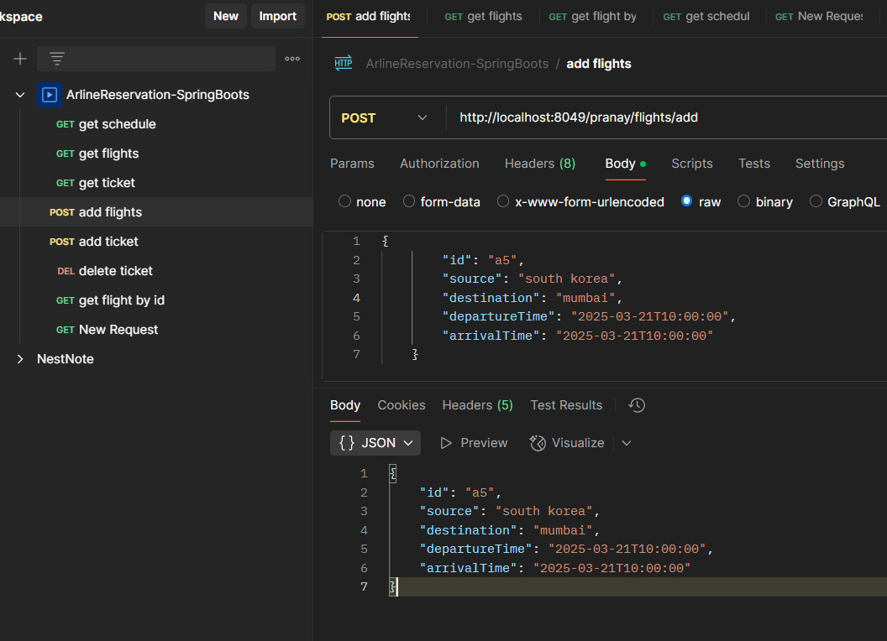

# ✈️ Airline Management System (Spring Boot)

## 📌 Overview
This project is a Spring Boot-based Airline Management System that allows users to view flight schedules, book tickets, retrieve ticket details, and cancel tickets while ensuring proper validation for duplicate bookings and errors.

## 🚀 Tech Stack
It utilizes Spring Boot for REST APIs, Java 21 as the programming language, Maven for dependency management, Spring Web for creating RESTful endpoints, Lombok to reduce boilerplate code, and Postman for API testing.

## 🔧 Setup Instructions
1. Clone the repository:
   ```sh
   git clone https://github.com/Pranay-Rokade/AirlineReservation-SpringBoots
   cd AirlineReservation-SpringBoots
   ```
2. Build and run the project using Maven:
   ```sh
   mvn clean install
   ```
3. The application will start on `http://localhost:8049/pranay`

## 📌 API Endpoints

### 1️⃣ **Add a Flight**
- **Endpoint:** `POST /pranay/flights/add`
- **Example Request:**
  ```json
  {
    "id": "a5",
    "source": "south korea",
    "destination": "mumbai",
    "departureTime": "2025-03-21T10:00:00",
    "arrivalTime": "2025-03-21T10:00:00"
  }
  ```
- **Screenshot:**
  

---

### 2️⃣ **Get All Flights**
- **Endpoint:** `GET /pranay/flights/`
- **Example Request:**
  ```http
  GET http://localhost:8049/pranay/flights/
  ```
- **Screenshot:**
  

---

### 3️⃣ **Get Flight by ID**
- **Endpoint:** `GET /pranay/flights/{id}`
- **Example Request:**
  ```http
  GET http://localhost:8049/pranay/flights/a5
  ```
- **Screenshot:**
  

---

### 4️⃣ **Get Flight Schedule by Date**
- **Endpoint:** `GET /pranay/flights/{id}/schedules?dates=startDate`
- **Example Request:**
  ```http
  GET http://localhost:8049/pranay/flights/a5/schedules?dates=2025-03-21
  ```
- **Screenshot:**
  

---

### 5️⃣ **Get Flights Sorted by Departure Time**
- **Endpoint:** `GET /pranay/flights/?sort=asc`
- **Example Request:**
  ```http
  GET http://localhost:8049/pranay/flights/?sort=asc
  ```
- **Screenshot:**
  

---

### 6️⃣ **Get Ticket Details**
- **Endpoint:** `GET /pranay/tickets/{id}`
- **Example Request:**
  ```http
  GET http://localhost:8049/pranay/tickets/49
  ```
- **Screenshot:**
  

---

### 7️⃣ **Book a Ticket**
- **Endpoint:** `POST /pranay/tickets`
- **Example Request:**
  ```json
  {
    "id": "49",
    "passengerName": "pranay",
    "email": "xyz@gmail.com",
    "seatNumber": "B049",
    "flightId": "a1"
  }
  ```
- **Screenshot:**
  

---

### 8️⃣ **Cancel a Ticket**
- **Endpoint:** `DELETE /pranay/tickets/{id}`
- **Example Request:**
  ```http
  DELETE http://localhost:8049/pranay/tickets/49
  ```
- **Screenshot:**
  

---

## 📝 Validations Implemented
- **Duplicate booking prevention** (same passenger cannot book the same flight multiple times)
- **Ticket cancellation checks** (only valid tickets can be canceled)
- **Flight existence validation** (cannot book tickets for non-existent flights)
- **Email format validation** (ensures correct email input)

## 🤝 Contributing
Contributions are welcome! Feel free to fork the repository and submit a pull request.

## 📄 License
This project is licensed under the MIT License.
